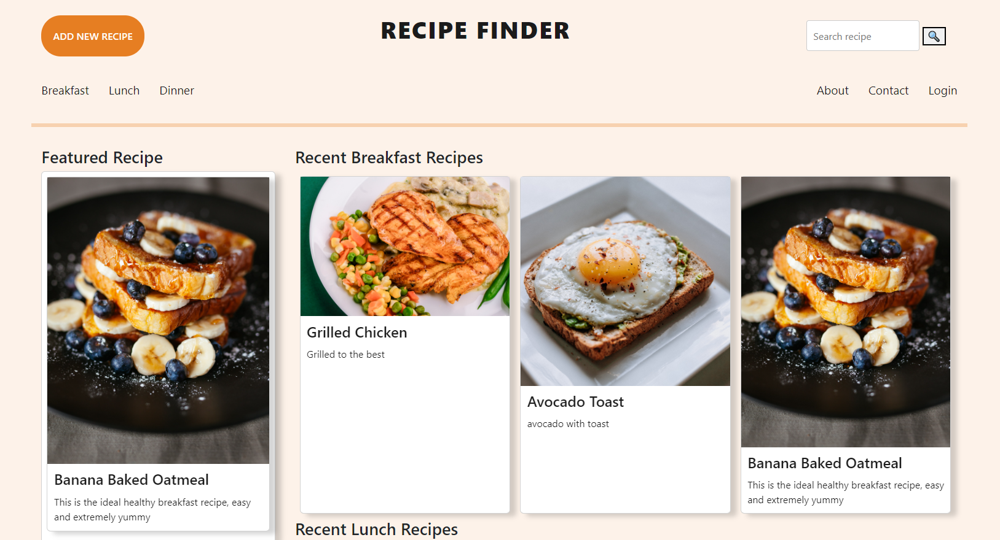
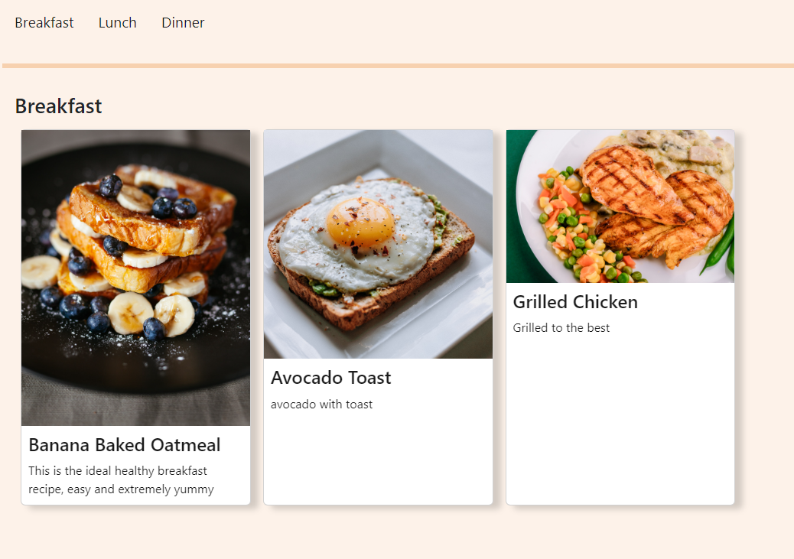
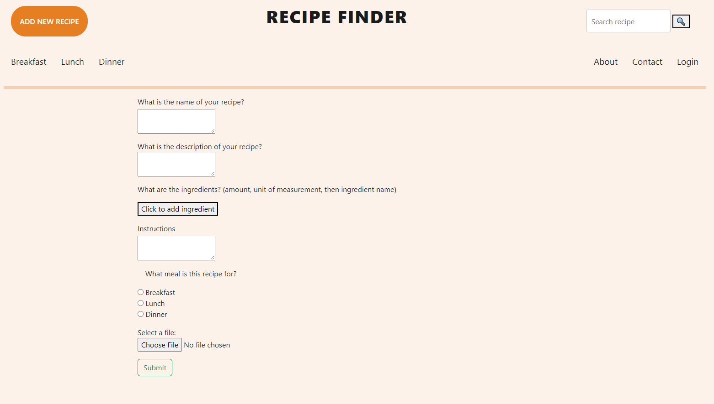

# Your Favorite Recipe Finder

The idea behind this project originated from the desire to create a mental health-driven website sponsored by Sunshine Wellness Center. As we live in this tech-centric world; school, work, playing games, and other activities have migrated online due to many factors including COVID19. The people who engage in these activities at home need a website that encourages home-cooking by providing an easy way to find recipes.

## Audience

The target audience is you, the user behind the screen. We believe this website can be a great resource for all people. With COVID-19 still ongoing, why not make staying at home more enjoyable by preparing some delicious recipes?

## Functionality

We created a recipe finder application that contains a collection of recipes for the categories of breakfast, lunch, and dinner. The user can additionally choose to add their own recipe to the website. The user can do so by clicking the ADD NEW RECIPE button. The user will be directed to a form where the user can enter the recipe's information, including name, description, instructions, ingredients, and a corresponding image.

## Technologies

The programming languages used to crated this project include Handlebars, CSS (Bootstrap and GoogleFonts), JavaScript, Node.js, Express, mySQL, Sequelize, ingredient parser (npm package), and LucidChart for creating our diagram and front-end design during planning phase.

